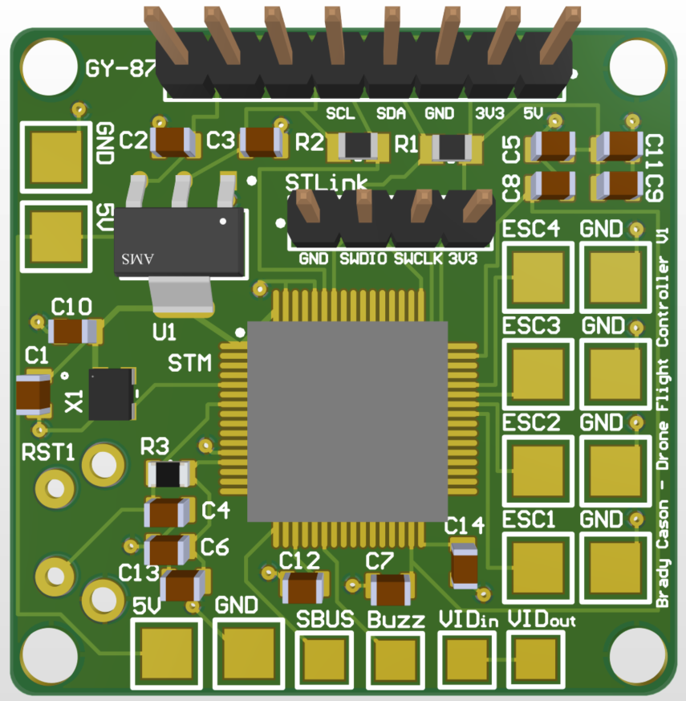

# Custom Drone Flight Controller for FPV Racing Drone
Code written in C for STM32 MCU on a custom made PCB. This board replaces the Flight Controller of a quadcopter and allows for easy reprogramming.

# PCB

# PID Controller
I used a PID (Proportional-Integral-Derivative) Controller that uses imput from an IMU to smoothly adjust the drone and keep it level.

# Extra Features
The Flight Controller PCB also has a magnetometer (compass), barometer, buzzer, and build in Video Port to connect the drone's camera with the transmitter.
